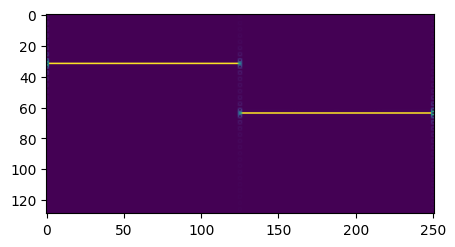

# Basic Usage 

## Generate and play a sine wave

```python
from audio_signal.core import AudioSignal
sig = AudioSignal.wave(freq=440, time=2, sr=16000)
sig.play()
```

## Load from file

```python
from audio_signal.core import AudioSignal
sig = AudioSignal('audio.wav', sample_rate=16000)
```

## Save to file

```python
sig.save('output.wav')
```

## Change playback speed

```python
sig_fast = sig.clone().speed(1.5)  # 1.5x faster
sig_fast.play()
```

## Convolve and correlate

```python
import torch
kernel = torch.ones(1, 100) / 100  # simple moving average filter

convolved = sig.convolve(kernel)
correlated = sig.correlate(kernel)
```
# Basic Usage 

## AudioSignal IS a torch.Tensor

```python
from matplotlib import pyplot as plt

a = AudioSignal.wave(1000,1,8000)
b = AudioSignal.wave(2000,1,8000)
c = torch.hstack([a,b])
print(c.sample_rate)

spectrogram = torch.stft(c,256,return_complex=True).abs()
plt.figure(figsize=(5,10))
plt.imshow(spectrogram[0])
plt.show()
```




## Use it for every torch compatible operation (including nn)
here is a small convnet taking an AudioSignal as input

```python
from torch import nn
# from audio_signal import AudioSignal

class ConvBlock(nn.Module):
  def __init__(self):
    super().__init__()

    self.conv = nn.Conv1d(1,1,3,1,1)
    self.bn = nn.BatchNorm1d(1)
    self.relu = nn.ReLU()
    self.pool = nn.MaxPool1d(2)
  def forward(self,x):
    x = self.conv(x)
    x = self.bn(x)
    x = self.relu(x)
    x = self.pool(x)
    return x

a = AudioSignal.wave(1000,1,8000)
model = ConvBlock()
model(a.unsqueeze(0)).shape
# torch.Size([1, 1, 4000])
```
